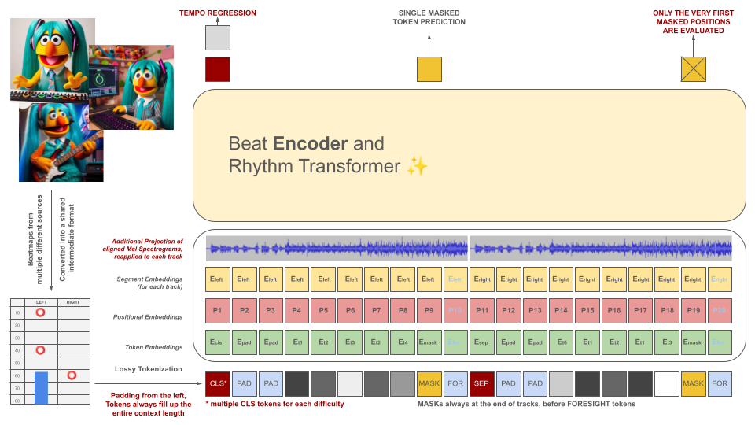

# Beat Learning
Have you ever wanted to play a song that wasn't available in your favorite rhythm game? Have you ever wanted to play infinite variations of that song?

This Open Source research project aims to democratize the process of automatic beatmap creation, offering accessible tools and foundation models for game developers, players and enthusiasts alike, paving the way for a new era of creativity and innovation in rhythm gaming. 

Examples (more coming soon):
- [Quixotic - Live Concert (OSU medium)](https://www.youtube.com/watch?v=CV0le0Tbx1U)
- [Quixotic - Turbo Interceptor (OSU hard)](https://www.youtube.com/watch?v=iaeQxMU0ggc)
- [S3RL Ft Kayliana - You Are Mine (OSU hard)](https://www.youtube.com/watch?v=tyhkMdpbRi8)
- [Yooh - Noisy Happiness [Yooh Remix]](https://youtu.be/KYU2QJx4_yQ)

## How to Use
You will first need to install [Python 3.12](https://www.python.org/downloads/), go to the repository's directory and create a virtual environment via:
```
python3 -m venv venv
```
Then call `source venv/bin/activate` or `venv\Scripts\activate` if you are on a Windows machine.
After the virtual environment has been activated, you can install the required libraries via:
```
pip3 install -r requirements.txt
```
You can use Jupyter to access the example `notebooks/`:
```
jupyter notebook
```

You can try the [Google Collab](https://colab.research.google.com/drive/1KpfE-pkmzc6c_mISQdKvBH5gqVTvFao3?usp=sharing) version too, as long as you have GPU instances available (the default CPU ones take forever to convert a song).

The pipeline only supports OSU beatmaps at the moment. 

## How to Contribute & Roadmap
This repository is still a **WORK IN PROGRESS**. The goal is to develop generative models capable of automatically producing beatmaps for a diverse array of rhythm games, regardless of the song. This research is still ongoing, but the aim is to get MVPs out as fast as possible.

All contributions are valued, especially in the form of compute donations for training foundation models. So, if you're interested, feel free to pitch in! 

1. Help to make the model easier to use
- Simplify beatmap generation through Notebooks / Collab / Spaces / Gradio Apps etc.
- Add proper setup.py and allow for more ways of creating virtual environments / doing containerization
- Better integration with HuggingFace (extend the model class to smoother loading / saving)
- Add autoamtic tests and github hooks, make the code production ready + add more detailed documentation
- Visualize attention weights and embeddings

2. Support more Rhythm Games
- Improve the current work-in-progress OSU beatmap generator (only OSU maps and simple HIT objects are supported, without any sliders at the moment) + support Taiko and Mania map generation
- Support additional rhythm games (currently the model is limited to rhythm games with 1, 2 or 4 tracks, so Guitar Hero-like games with 5 tracks will have to wait), implement converters that work both ways

3. Train Bigger and Better Models with More Data and Compute


Join us in exploring the endless possibilities of AI-driven beatmap generation and shaping the future of rhythm games!

Model(s) are available on [HuggingFace](https://huggingface.co/sedthh/BeatLearning).

## BEaRT
Rhythm game beatmaps are initially converted into an intermediate file format, which is then tokenized into 100ms chunks. Each token is capable of encoding up to two different events within this time period (holds and / or hits) quantized to 10ms accuracy. The vocabulary of the tokenizer is precalculated rather than learned from the data to meet this criterion. The context length and vocabulary size are intentionally kept small due to the scarcity of quality training examples in the field.


These tokens, along with slices of the audio data (its projected Mel Spectogram aligned with the tokens), serve as inputs for a masked encoder model. Similar to BeRT, the encoder model has two objectives during training: estimating the tempo through a regression task and predicting the masked (next) token(s) via a *hearing loss* function.
Beatmaps with 1, 2, and 4 tracks are supported. Each token is predicted from left to right, mirroring the generation process of a decoder architecture. However, the masked tokens also have access to additional audio information from the future, denoted as foresight tokens from the right.

## Legal
The AI model's purpose is not to devalue individually crafted beatmaps, but rather:

1. To assist map creators in efficiently producing new beatmaps.
2. To aid smaller developers in effortlessly creating content for their rhythm games.
3. To enhance exposure for indie music artists by incorporating their work into video games.

All generated content **must comply with EU regulations** and be appropriately labeled, including metadata indicating the involvement of the AI model.

GENERATION OF BEATMAPS FOR COPYRIGHTED MATERIAL IS STRICTLY PROHIBITED! ONLY USE SONGS FOR WHICH YOU POSSESS RIGHTS!

 The audio featured in OSU file examples originates from artists listed on the OSU website under the section [featured artists]((https://osu.ppy.sh/beatmaps/artists)) and is licensed for use specifically in osu!-related content.

To prevent your beatmap from being utilized as training data in the future, include the following metadata in your beatmap file:
```
robots: disallow
```

## Special Thanks
The project draws inspiration from a previous attempt known as [AIOSU](https://www.nicksypteras.com/blog/aisu.html).  
Besides relying on the OSU's wiki, [osu-parser](https://github.com/nojhamster/osu-parser) has been instrumental in clarifying beatmap declarations (especially sliders). The transformer model was influenced by [NanoGPT](https://github.com/karpathy/nanoGPT) and from the pytorch implementation of [BeRT](https://github.com/codertimo/BERT-pytorch/).